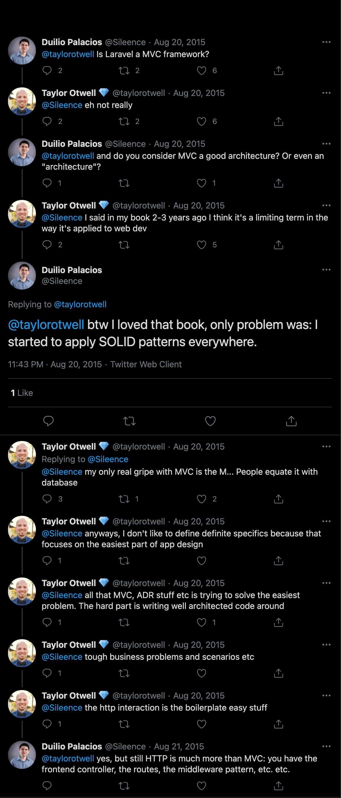
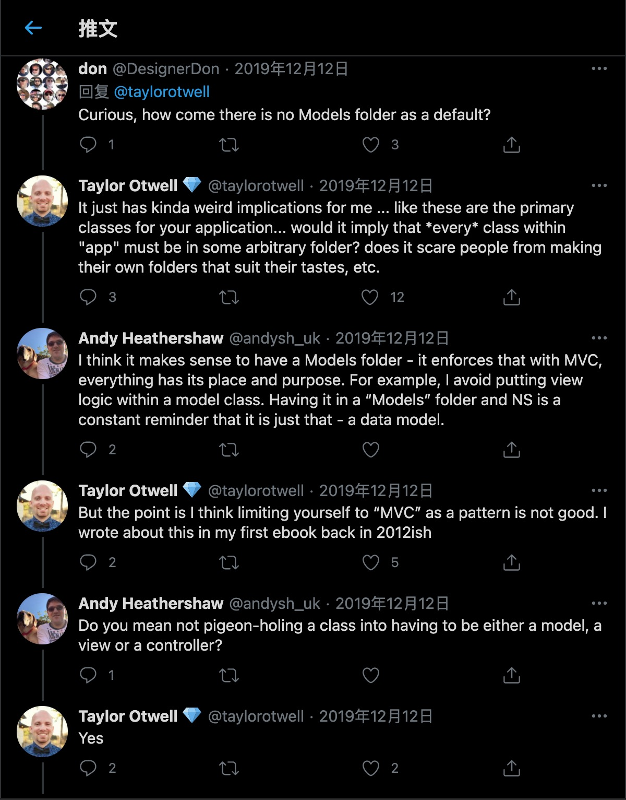
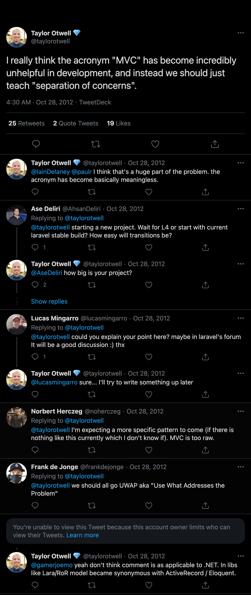

#说明

  日常工作实践、学习整理。目前使用PHP7.4（后续可能会不断更新）,语法糖一般不做旧版本的兼容。除了用到PHP官方PSR规范、Laravel约定以外，
  还会引进其他语言、框架以及业界一些较为流行或认可的方案和设计规范。

## git提交规范

- angular的提交规范

- IDEA的git-commit-template插件

- 本地git提交规范检测的钩子脚本：[commit-msg](./commit-msg)
```
 1、commit-msg文件放到: 当前工作目录/.git/hooks/下     
 2、设置commit-msg权限为可执行  执行命令:chmod u+x commit-msg  
 3、测试不规范的格式提交,提交失败并给出提示。 
```

## 更新日志

- [什么是更新日志](https://keepachangelog.com/zh-CN/0.3.0/)

- [CHANGELOG](./CHANGELOG.md)


## 项目

### laravel-ddd-example

[domain-driven-design-ddd-principles-with-laravel](https://content-garden.com/domain-driven-design-ddd-principles-with-laravel)

[Laravel Models folder: To Be or Not To Be](https://laraveldaily.com/laravel-models-folder-not/)

 DDD(领域驱动设计)在laravel项目中的实践示例

 初始化构建：

-  通过 Composer 创建项目

```bash
    //安装全局compoer,略
    composer create-project --prefer-dist laravel/laravel laravel-ddd-example
```

-  通过 Laravel 安装器 

```bash
    //可选，如果之前已安装存在网络超时等问题，先卸载旧版本
    composer global remove laravel/installer
 
    composer global require laravel/installer

    laravel new laravel-ddd-example
```
    
###  扩展

关于Laravel8，我觉得比较有意思地一点变化是重新引入了Models目录结构。
从Laravel5开始，被移除的模型目录又回归了。对于社区大部分开发者来说，肯定是令人兴奋的。
但Laravel作者从始至终并不觉得这是一个好的设计，其本人也在Twitter上承认这是一种妥协。"我个人觉得它是没有必要的，但是社区中的大多数人似乎都喜欢它。"
如果事先有阅读过作者早期的电子书[《从学徒到工匠》（译）](#from-apprentice-to-artisan)，也能从书中的第5章应用结构中找到原因。

> I personally like it's unnecessary but most of the community seems to prefer it.
> -Taylor Otwell


[Laravel 8.x skeleton will include a "app/Models" directory by default.](https://twitter.com/taylorotwell/status/1296556354593792000)

对于Models模型文件，早期也是和社区大部分人的意见一致。近两年接触到DDD等设计思想，才渐渐体会到作者的设计意图。
为了方便查阅，以下就Laravel创作者泰勒·奥特威尔的一些观点进行了整理。


####关于MVC

> I really think the acronym "MVC" has become incredibly unhelpful in development, and instead we should just teach "separation of concerns".
> -Taylor Otwell

> But the point is I think limiting yourself to “MVC” as a pattern is not good. I wrote about this in my first ebook back in 2012ish
> -Taylor Otwell









twitter原文:

[Is Laravel a MVC framework?](https://twitter.com/Sileence/status/634390267966173184)

[MVC has become incredibly unhelpful in development](https://twitter.com/taylorotwell/status/262290285499936768)

[I think limiting yourself to “MVC” as a pattern is not good](https://twitter.com/taylorotwell/status/1204882498230116353)


<p id="from-apprentice-to-artisan">最后建议通读 Taylor Otwell 的电子书 《From Apprentice To Artisan》</p>

参考地址：[https://learnku.com/articles/6364/laravel-from-apprentice-to-artisan-by-taylor-otwell](https://learnku.com/articles/6364/laravel-from-apprentice-to-artisan-by-taylor-otwell)


---

Laravel VS Symfony VS Ruby on rails VS Spring  

[Debate: Symfony VS Laravel](https://dev.to/itsmukulmishra/debate-symfony-vs-laravel-1bh9)

[Taylor Otwell: “Thin” Controllers, “Fat” Models Approach](https://laraveldaily.com/taylor-otwell-thin-controllers-fat-models-approach/)
  

[laravel-best-practices(中文)](https://github.com/alexeymezenin/laravel-best-practices/blob/master/chinese.md)


####关于lumen

1、除非项目一开始只做API，除非项目永远不会变大变复杂。否则不推荐使用lumen。
2、使用完整版的Laravel吧，否则后续你还会把缺失的功能一项项加回去，开发体验也不好。
3、项目初期，很微小的性能差异，起步了决定作用。项目做大后的性能问题，不是框架本身能解决的。
4、选择lumen更多的是心里因素，觉得他快。实际效益一般。

Laravel和Lumen的创作者自己也是建议直接用Laravel。以下列举他和一些开发者讨论的观点。

[I think always use Laravel](https://twitter.com/taylorotwell/status/1306287663109091329)

[Is it worth to switch to #Laravel for better developer experience with the downside of a decreased performance?](https://twitter.com/devgummibeer/status/1212731942455717888)

[Most of the time people choose Lumen for psychological reasons not technical reasons](https://twitter.com/taylorotwell/status/1212832185830510592)

