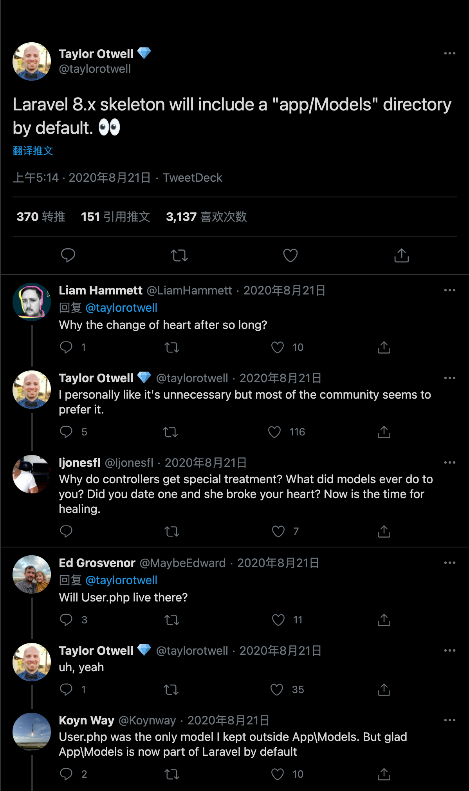

## 关于Laravel 

关于Laravel8，我觉得比较有意思地一点变化是重新引入了Models目录结构。
从Laravel5开始，被移除的模型目录又回归了。对于社区大部分开发者来说，肯定是令人兴奋的。
但Laravel作者从始至终并不觉得这是一个好的设计，其本人也在Twitter上承认这是一种妥协。"我个人觉得它是没有必要的，但是社区中的大多数人似乎都喜欢它。"
如果事先有阅读过作者早期的电子书，也能从书中的第5章应用结构中找到原因。

[《从学徒到工匠》（译）](https://learnku.com/articles/6364/laravel-from-apprentice-to-artisan-by-taylor-otwell)

> I personally like it's unnecessary but most of the community seems to prefer it.
> -Taylor Otwell

[Laravel 8.x skeleton will include a "app/Models" directory by default.](https://twitter.com/taylorotwell/status/1296556354593792000)

对于Models模型文件，早期也是和社区大部分人的意见一致。近两年接触到DDD等设计思想，才渐渐体会到作者的设计意图。

