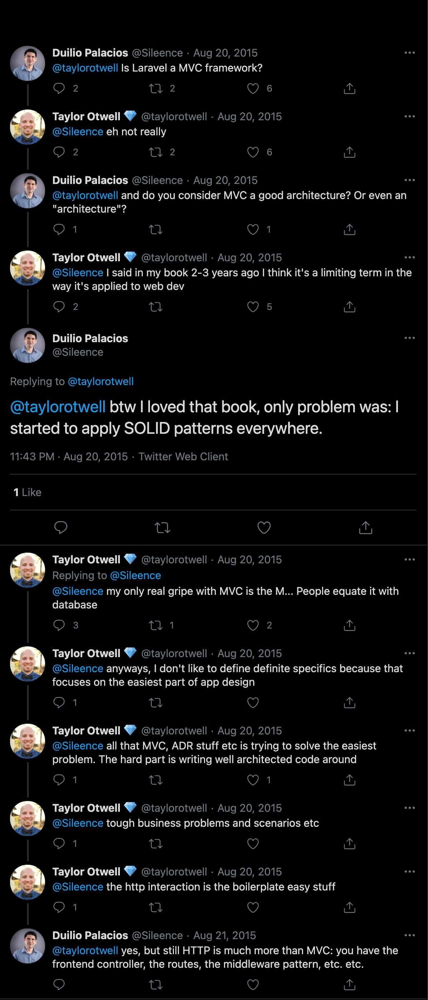
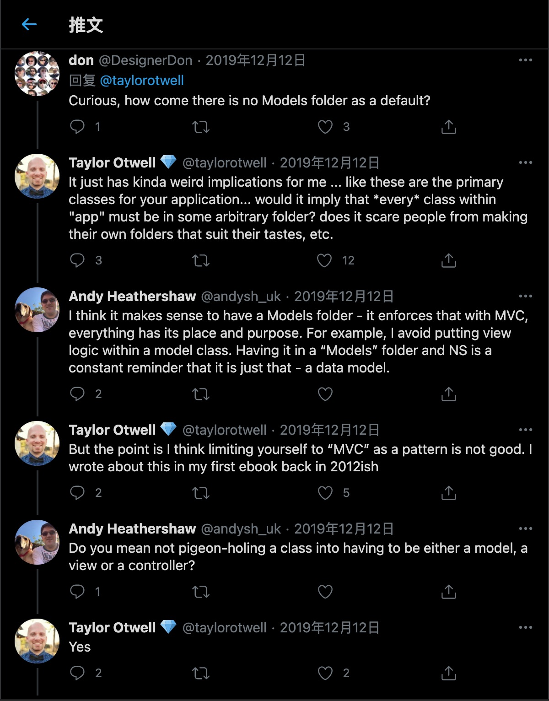
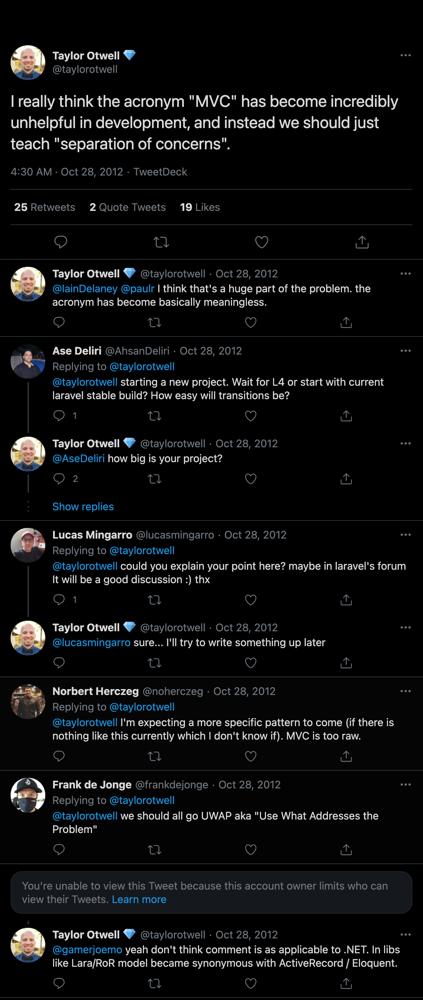

## 关于MVC

本章节承接关于Laravel章节，旨在引用创建者本人关于MVC的观点，补充说明Laravel的设计意图。

> I really think the acronym "MVC" has become incredibly unhelpful in development, and instead we should just teach "separation of concerns".
> -Taylor Otwell

> But the point is I think limiting yourself to “MVC” as a pattern is not good. I wrote about this in my first ebook back in 2012ish
> -Taylor Otwell

Twitter出处:

<a href="https://twitter.com/Sileence/status/634390267966173184" target="_blank">Is Laravel a MVC framework?</a>

<a href="https://twitter.com/taylorotwell/status/262290285499936768" target="_blank">MVC has become incredibly unhelpful in development</a>

<a href="https://twitter.com/taylorotwell/status/1204882498230116353" target="_blank">I think limiting yourself to “MVC” as a pattern is not good</a>

